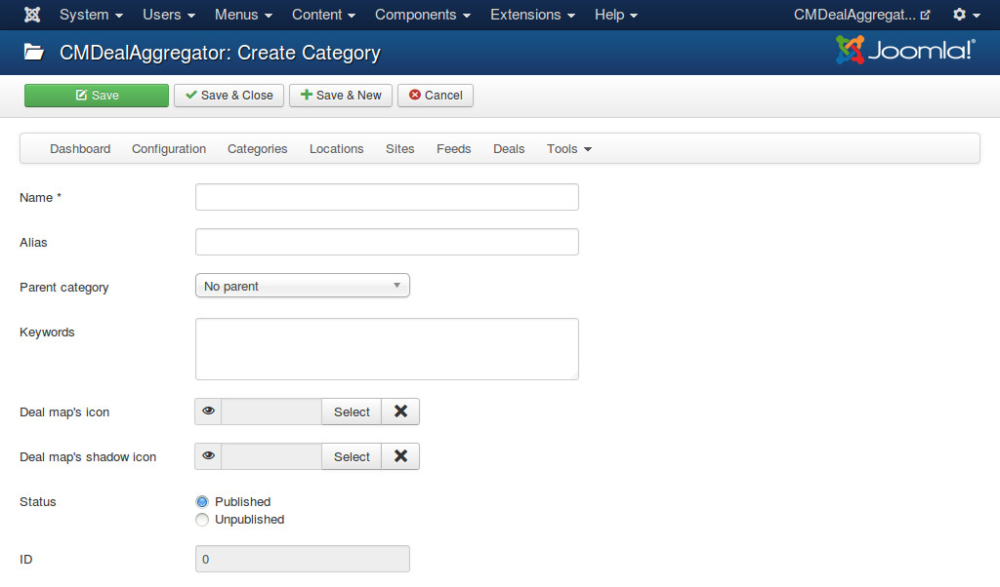

.. _ref-categories:

==========
Categories
==========

In your back-end, you navigate to Components -> CMDealAggregator to access the Dashboard, click "Categories" in the component's menu to access category list.

Click on "New" button on the toolbar to create a new category.

* **Name**: The name of your category.
* **Alias**: Used in URLs for filtering deals in categories.
* **Parent category**: We only support 2 levels of categories, to create a parent category you choose "No parent" in "Parent category" option, to create a child category you just choose the parent category name in "Parent category" option.
* **Keywords**: You need to provide some keywords for assigning deals to this category. Keywords are separated by a space. Keywords can be in uppercase or lower case. When you assign XML feed's tags to deal's fields, you can select what XML tags you want to get their content for category assignment. The content of these tags will be compared with the keywords of all of your categories. The category having the most matched keywords will be the category which the deal is assigned to.
* **Deal map icon**: Custom icon you want to use for deals in a category in deal map.
* **Deal map icon**: Custom icon you want to use as a shadow for deal map icon. If you don't what to have shadow effect, just leave this field empty.
* **Status**: Category in "Unpublished" status is not visible in front-end.