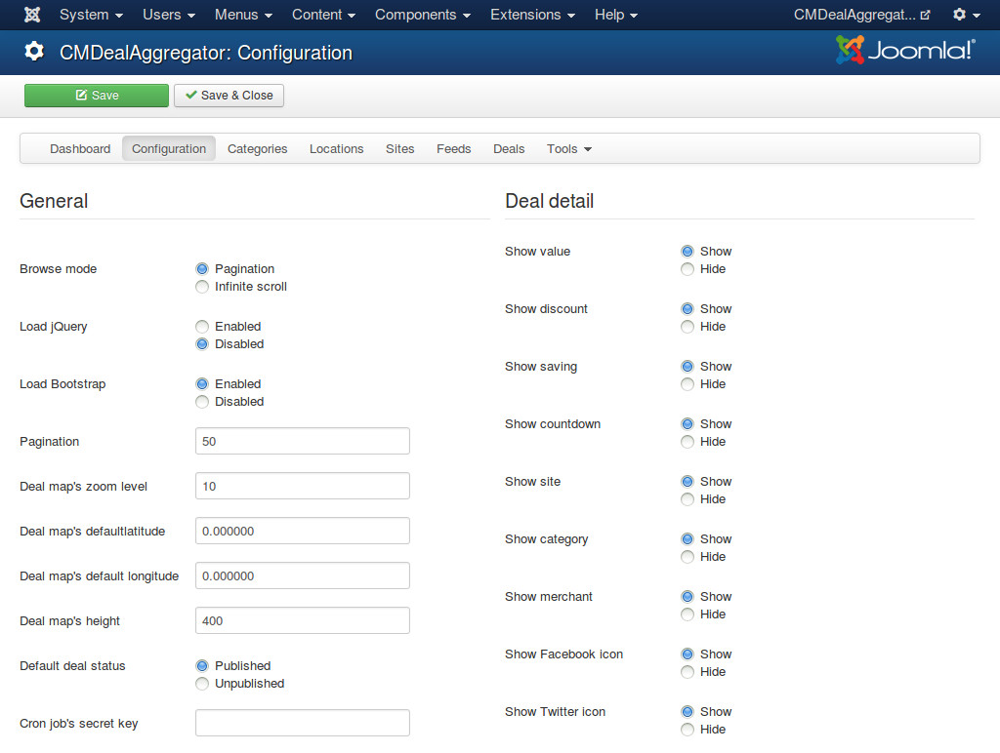

.. _ref-configuration:

=============
Configuration
=============

In your back-end, you navigate to Components -> CMDealAggregator to access the Dashboard, click "Configuration" in the component's menu to access the component's configuration.

The options are separated into 2 groups: "General" and "Deal detail".

"General" options are for various settings in many places in the component:

* **Browse mode**: How users browse deals on your site. You can use the traditional pagination or infinite scroll (new deals are showed everytime we scroll to the bottom of the page).
* **Load jQuery**: Enable loading jQuery. You should disable if your site already loads jQuery. jQuery is required by Bootstrap.
* **Load Bootstrap**: Enable loading Bootstrap. You should disable if your site already loads Bootstrap. CMDealAggregator requires Bootstrap 2.x.
* **Pagination**: The quantity of deals displayed per page for pagination browse mode, or per load for infinite scroll browse mode.
* **Deal map's zoom level**: The default zoom level of deal map.
* **Deal map's latitude**: The latitude of the default location in deal map.
* **Deal map's longitude**: The longitude of the default location in deal map.
* **Deal map's width**: The width of deal map.
* **Deal map's height**: The height of deal map.
* **Default deal status**: The status of deals after they are imported. You may want them to be unpublished to review before publishing them.
* **Cron job's secret key**: Your custom and secret text for using web based cron job. This secret key is added to the cron URLs so that only you can run the cron jobs. The secret key must only contain A-Z or underscores (not case sensitive).

"Deal detail" options are for showing or hiding the information in deal detail page.