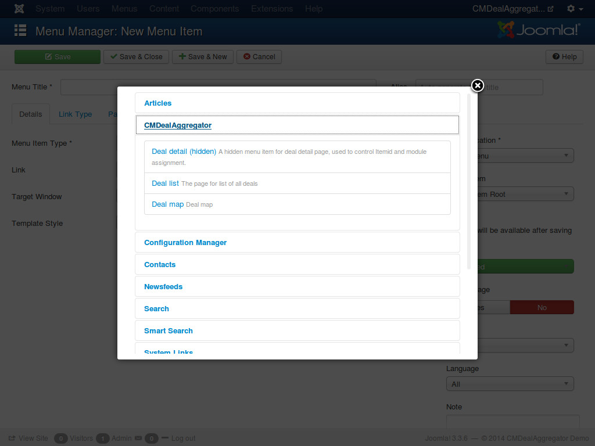

========
Deal map
========

Similar to creating a menu item for deal list in :ref:`ref-deal_list_menu_item`, to create a menu item for deal map you select "Deal map" as menu item type.

Make sure you already select a deal map icon for your category (see :ref:`ref-categories`),  you can also set the default location in :ref:`ref-configuration`.

Visit deal map menu item in front-end, you can see the deals are listed in the map, click on the icon you can see the deal's information.

