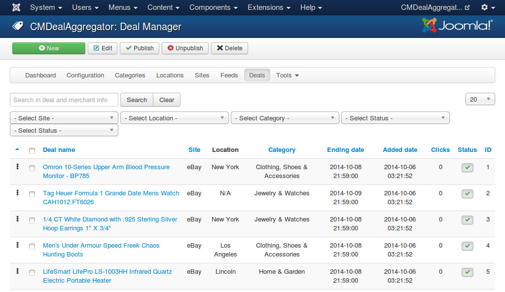
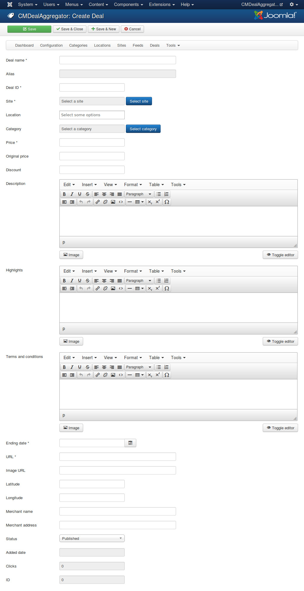
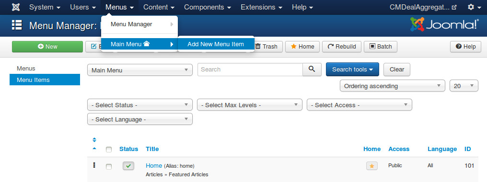
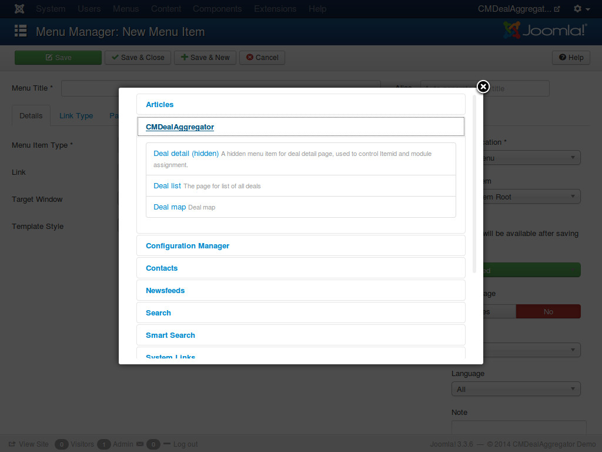
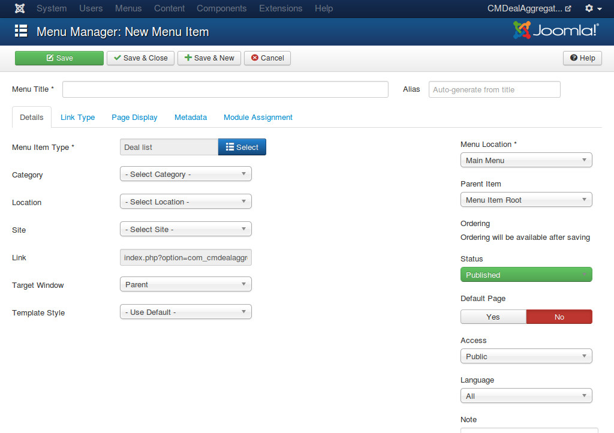

=====
Deals
=====

Manage deals
------------

To see the list of imported deals, you navigate to Components -> CMDealAggregator -> click "Deals" in the component's menu.

You can use the filter tools to filter the deals in the list.

You can click "New" button on the toolbar to create a new deal manually.

* **Deal name**: The name of the deal.
* **Alias**: Used in search engine friendly URL.
* **Deal ID**: The ID of the deal on its group buying site.
* **Site**: The group buying site which this deal is on.
* **Location**: The location where the deal is in.
* **Category**: The category which the deal is in.
* **Price**: The price of the deal.
* **Original price**: The original price of the deal.
* **Discount**: The discount value (in currency unit or percentage).
* **Description**: The deal's description.
* **Highlights**: The deal's highlights.
* **Terms and conditions**: The deal's terms and conditions.
* **Ending date**: The date the deal expires.
* **URL**: The link to the deal.
* **Latitude**: Google Map latitude of the deal's loation. This info is required in displaying the deal in deal map.
* **Longitude**: Google Map longitude of the deal's location. This info is required in displaying the deal in deal map.
* **Merchant name**: The name of the merchant who owns the deal.
* **Merchant address**: The merchant's address.
* **Status**: Deal is only published if in published status.
* **Added date**: The date the deal is added to your system.
* **Clicks**: How many users click to view the deal.

.. _ref-deal_list_menu_item:

Deal List menu item
-------------------

To create a menu item for deal list, in the back-end's top menu you go to Menu Manager -> select a menu -> Add New Menu Item, you are taken to the list of the menu items of the selected menu. This list is similar to the screenshot below.

Click "New" button on the toolbar to create a new menu item.

In the next form, you click "Select" button of "Menu Item Type" field, a new popup appears. In the popup you select "Deal list" from CMDealAggregator.

Switch to the "Options" tab, there are 3 filter options.

* **Category**: Select a category if you want to display the deals in a specific category.
* **Location**: Select a location if you want to display the deals in a specific location.
* **Site**: Select a site if you want to display the deals from a specific website.

If there is no category, location and site selected, the list will display all available deals.
