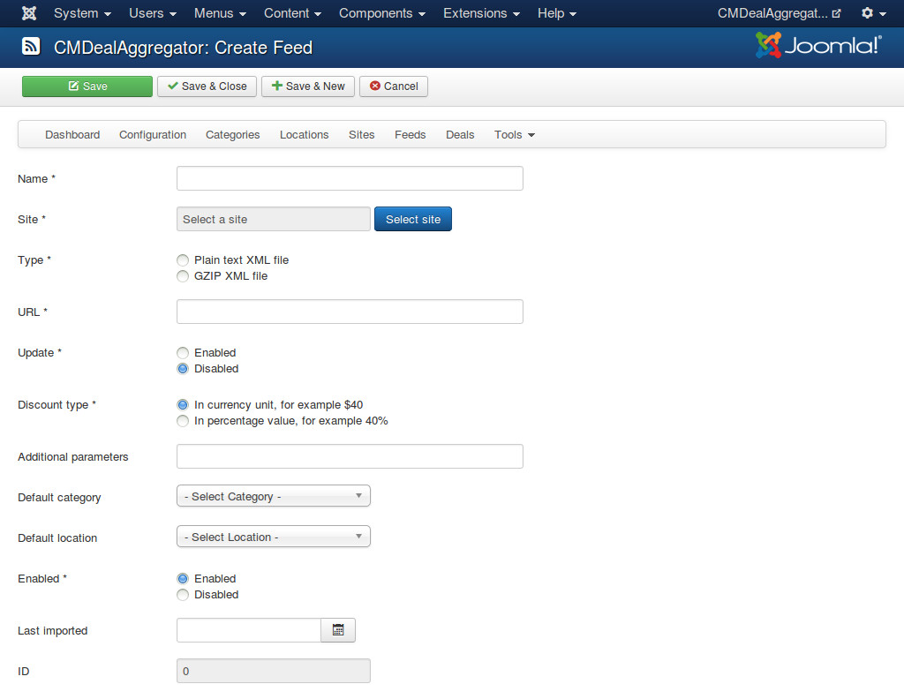
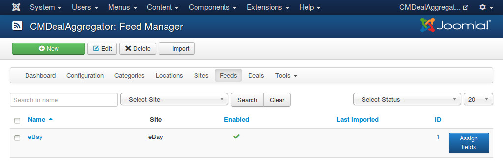
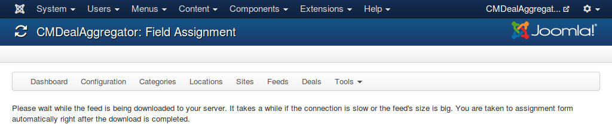
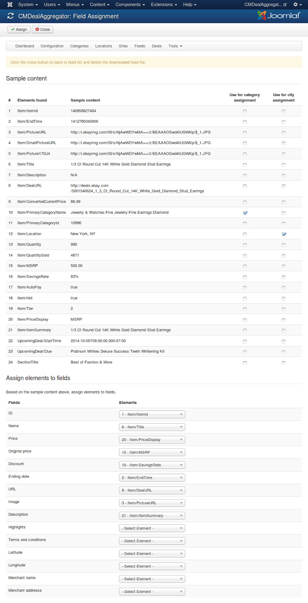
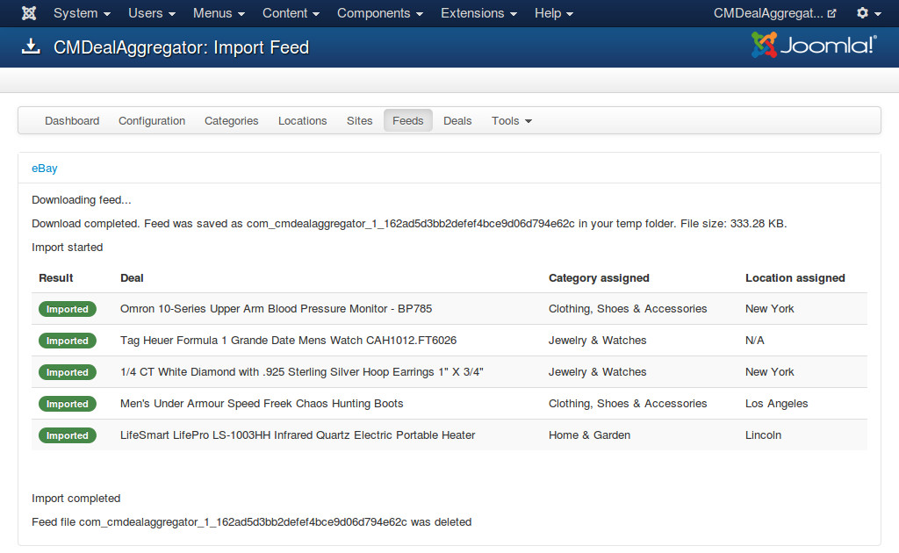

=====
Feeds
=====

Feed form
---------

In your back-end, you navigate to Components -> CMDealAggregator to access the Dashboard, click "Feeds" in the component's menu to access feed list.

Click on "New" button on the toolbar to create a new feed. Before creating a new feed, make sure you already have the link to the feed. The feed must be an XML document or a GZ file which contains an XML file.

* **Name**: The name of the feed. This name is for internal use only, it is not visible in front-end.
* **Site**: The group buying site of the deals in the feed.
* **Type**: The type of the feed file, plain XML file (*.xml) or compressed XML file in GZIP format (*.gz).
* **URL**: The URL to the feed.
* **Update**: If update is enabled, the data of imported deals will be update by the data in the feed, all your custom data will be lost. If update is disabled, only new deals are imported, imported deals are not updated.
* **Discount type**: The type of discount value which this feed provides. Some feed providers provide discount amount, some provide percentage value.
* **Additional parameters**: Additional parameters which are appened to the deal URL. You can use this to add your referral parameters. Parameters are separated by a "&" sign, for example: parameter1=value1&parameter2=value2.
* **Default category**: Select a category if you want to assign new deals to this category when we can't find any category for them.
* **Default location**: Select a location if you want to assign new deals to this location when we can't find any location for them.
* **Enabled**: Feed is only imported when it is enabled.
* **Last imported**: When this feed is imported the last time.

Assign fields
-------------

In the feed list, you click "Assign fields" button to assign XML's elements to deal's fields.

After you click "Assign fields", please wait until the feed file is downloaded to your server.

After the file is downloaded, you are taken to the form to assign fields.

Based on the sample content of the feed's elements, you assign elements to fields of deal.

Tip: You don't need to remember the element's name, you just need to remember the number in the first column of the sample content table and find it in the dropdown list. You can type the number to find the element faster if you use Joomla! 3.

To use the content of an element in checking and assigning category and location, you check "Use for category assignment" and "Use for city assignment" options in the sample content table.

Click "Assign" button on the toolbar to save, or click "Close" to cancel. After the assignment is saved or canceled, the feed file is deleted on your server.

Import deals
------------

In the feed list, select one or many feeds that you want to import, click "Import" button on the toolbar to import the feeds. You are taken to import page, in this page you can see the result of feed downloading and importing, what category and location every deal is assigned to.

