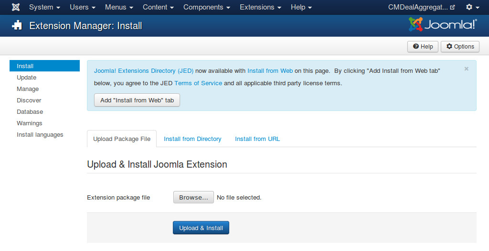

==========
Installing
==========

Log into the Joomla! Administrator section and click on the menu Extensions -> Extension
Manager, you will be in Install submenu. In Upload Package File section, choose the package and click Upload & Install button to install.

There is another alternative way to install. It is Install Directory. To install with this method you need to:

 * Create a temporary directory on your server.
 * Upload and uncompress the package file in the temporary directory you create above.
 * In the Install Directory field specify the server directory where the temporary directory is.
 * Click on the Install button and Joomla! will install the contents of the given directory.
