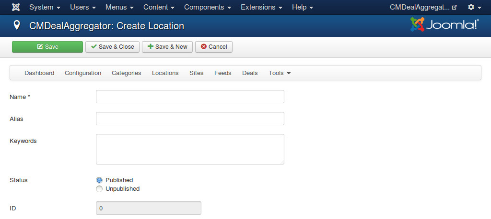

=========
Locations
=========

In your back-end, you navigate to Components -> CMDealAggregator to access the Dashboard, click "Locations" in the component's menu to access location list.

Click on "New" button on the toolbar to create a new location.

* **Name**: The name of your location.
* **Alias**: Used in URLs for filtering deals in locations.
* **Keywords**: You need to provide some keywords for assigning deals to this location. Keywords are separated by a space. Keywords can be in uppercase or lower case. When you assign XML feed's tags to deal's fields, you can select what XML tags you want to get their content for location assignment. The content of these tags will be compared with the keywords of all of your categories. The location having the most matched keywords will be the location which the deal is assigned to.
* **Status**: Location in "Unpublished" status is not visible in front-end.