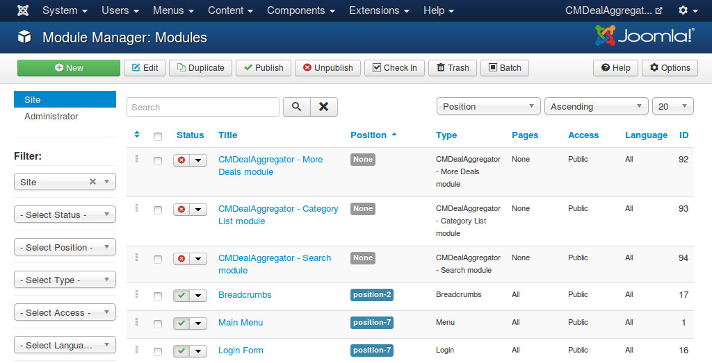
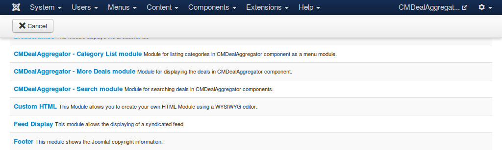

=================
More Deals module
=================

More Deals module helps you display deals on any page.

After you install the module package, you go to Extensions -> Module Manager, you can see the default module in the module list as "CMDealAggregator - More Deals module".

You can always create a new module, click the "New" button on the toolbar and select "CMDealAggregator - More Deals module" in the next page.

In the form, we have the following options for showing deals:

* **Display**: How the deals in the module is displayed, horizontally or vertically.
* **Module type**: What deals the module shows.

  * **Featured deals**: Show only specific deals, you need to provide the IDs of the featured deals in the below option.
  * **Random deals**: The deals are selected randomly.
  * **Popular deals**: The deals which are clicked the most are showed.
  * **Ending soon deals**: The deals which are going to expired are showed.

* **Number of deals**: Deal quantity to show in the module. This setting is not for Featured Deals.
* **Be affected by location search module**: If you choose "Yes", the result will only be the deals in the location which is selected in CMDealAggregator Search module. This setting is not for Featured Deals.
* **Deal IDs**: Only used for Featured Deals. You need to enter a deal ID or list of deal IDs to show (separated by a comma). Example: "1" for only show the deal having the ID is 1, "1,3,13,45" for showing many deals.

Sample results of vertical (on the right) and horizontal (on the left) display:

