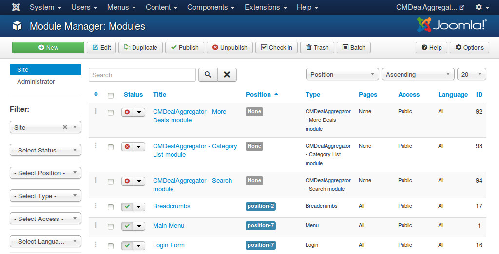

=============
Search module
=============

With Search module, you can search for deals by keyword, website, category and location.

After you install the module package, you go to Extensions -> Module Manager, you can see the default module in the module list as "CMDealAggregator - Search module".

You can always create a new module, click the "New" button on the toolbar and select "CMDealAggregator - Search module" in the next page.

.. image:: ../images/module_new.jpg

The module doesn't have any option to configure.