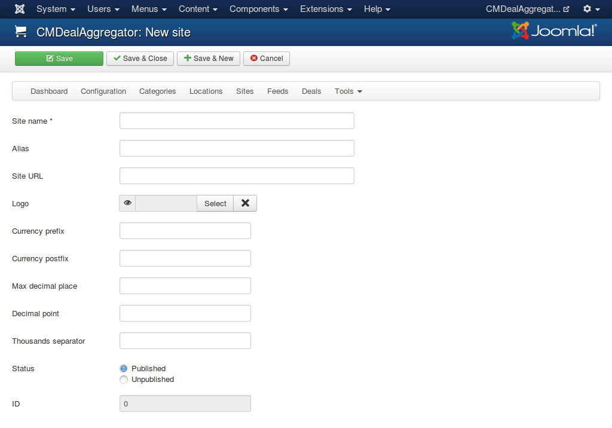

=====
Sites
=====

In your back-end, you navigate to Components -> CMDealAggregator to access the Dashboard, click "Sites" in the component's menu to access site list.

Click on "New" button on the toolbar to create a new site. You need to setup what currency the website uses. With this you have ability to list deals in different currencies.

* **Site name**: The name of the group buying website.
* **Alias**: Used in URLs for filtering deals in websites.
* **SiteURL**: The website address.
* **Logo**: The logo of group buying website. This logo is displayed in deal detail page.
* **Currency prefix**: If your currency sign/code stands before the amount, enter the sign/code in this field. For example, you enter '$', the result could look like: $100.
* **Currency postfix**: If your currency sign/code stands behind the amount, enter the sign/code in this field. For example, you enter '₣', the result could look like: 100₣.
* **Max decimal**: The number of decimal points.
* **Decimal point**: The symbol used to separate the integer part of your currency (a decimal number) from its fractional part.
* **Thousands separator**: The symbol used in digit grouping.
* **Status**: Site in "Unpublished" status is not visible in front-end.