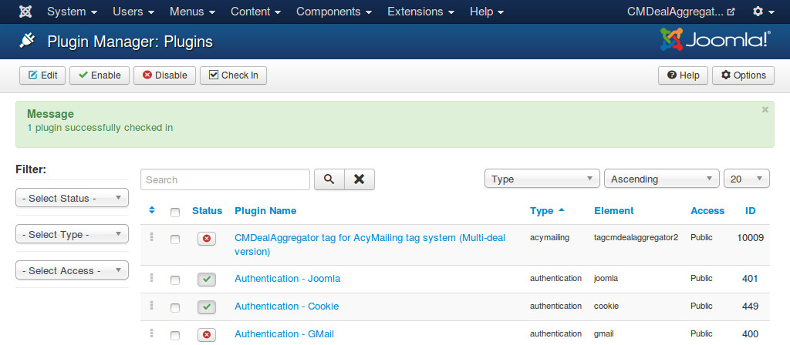
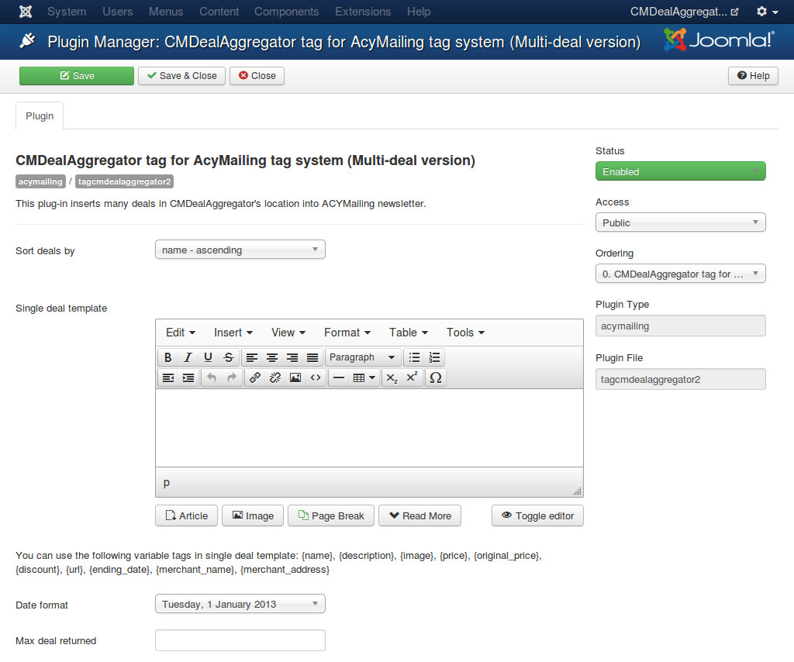
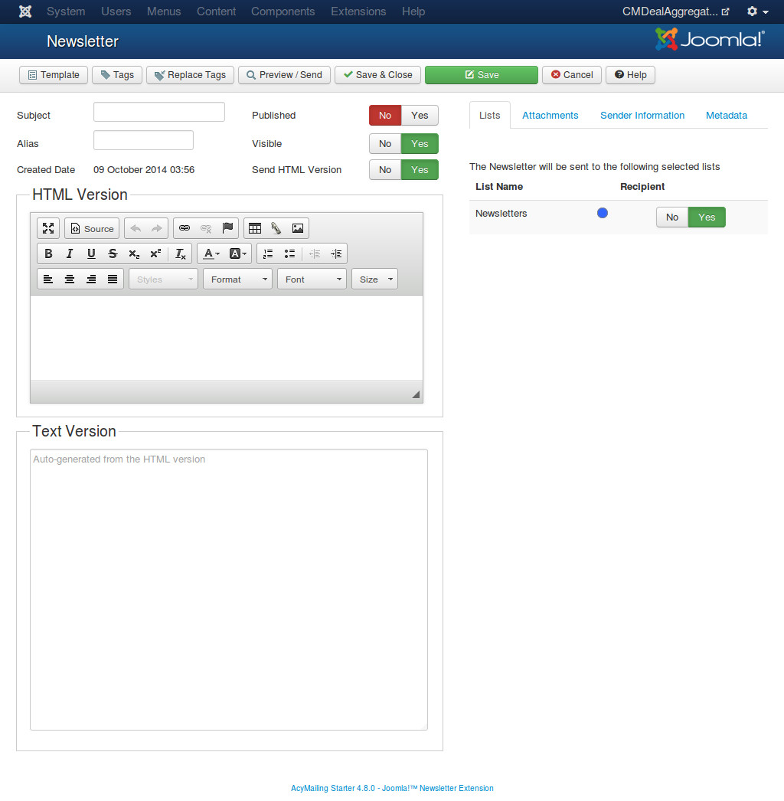
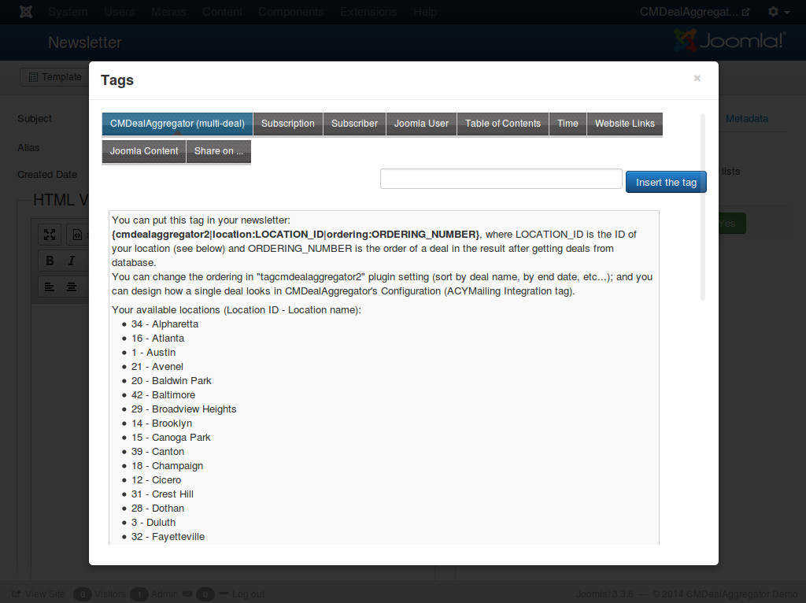

===========================
tagcmdealaggregator2 plugin
===========================

If you use `ACYMailing component <https://www.acyba.com/>`_ to send newsletter to your website's subscribers, you can use tagcmdealaggregator2 to insert deals into your newsletter, give you ability to send deals to your subscribers via email.

**Note**:

* In this section we only give instruction on how to use tagcmdealaggregator2 plugin, if you are new to ACYMailing, please check their `documentation <https://www.acyba.com/acymailing/doc.html>`_ to know how to use ACYMailing.
* This plugin is compatible with all ACYMailing versions (Starter, Essential, Business, Enterprise).

After you install tagcmdealaggregator2 plugin you can find it in Plugin Manager (Extensions -> Plugin Manager).

There are settings you need to configure before using the plugin:

* **Sort deals by**: The plug-in gets all active deals from the selected location before inserting them into ACYMailing newsetter, with this option you can sort deals in your desired ordering, this ordering will affect the result of your newsletter - which deal is displayed and which deal is not.
* **Single deal template**: How a single deal looks like. This template is displayed in ACYMailing newsletter as a single deal (every tag in newsletter will be replaced by this template). You can use the following tags in single deal template:

  * **{name}**: Deal's name.
  * **{description}**: Deal's description.
  * **{image}**: Deal's image.
  * **{price}**: Deal's price.
  * **{original_price}**: Deal's original price.
  * **{discount}**: Deal's discount value.
  * **{url}**: Deal's URL.
  * **{ending_date}**: Deal's ending date.
  * **{merchant_name}**: Merchant's name.
  * **{merchant_address}**: Merchant's address.

* **Date format**: Date format which is used for ending date in single deal template.
* **Max deal returned**: Limit the maximum quantity of returned deals. For example, you enter "10" if you only want to display 10 deals in your newsletter.

In your ACYMailing newsletter, click "Tags" button on the toolbar.

In the popup, you click "CMDealAggregator (multi-deal)".

Just follow the instruction, you can insert the tags for deals of every locations in CMDealAggregator.

For example, you want to display 5 deals from a location having ID 2, you can enter these lines into your
newsletter:

{cmdealaggregator2|location:2|ordering:1}

{cmdealaggregator2|location:2|ordering:2}

{cmdealaggregator2|location:2|ordering:3}

{cmdealaggregator2|location:2|ordering:4}

{cmdealaggregator2|location:2|ordering:6}

If there are 10 active deals in your location, only 5 will be displayed, they are deals in ordering 1, 2, 3, 4 and 6; the 5th, 7th, 8th, 9th, 10th deals are not displayed because there are no tags for them in the template. But if there are only 3 active deals, the tag for ordering 4 and 6 will be removed and no deal is displayed in the positions of those tags in your newsletter.