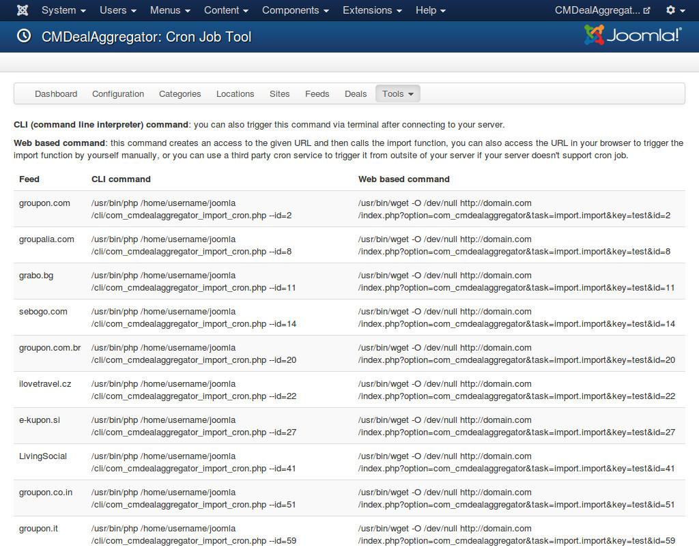

=====
Tools
=====

In your back-end, go to Components -> CMDealAggregator to access the Dashboard, click "Tools" in the component's menu and select 1 in 3 tools: Cleaner, Truncate, Cron jobs.

Cleaner
-------

Cleaner is the tool to delete the orphan feed files in your Joomla! temp folder.

The orphan feed files are the files which are downloaded while assigning fields or importing deals but they are not deleted after the progress is completed because of some reasons, for example a server's error occurs, you close the browser...

To delete the files, you just need to select them and click "Delete" button on the toolbar.

Truncate
--------

This tool helps you delete all deals in the table cmda_cmdealaggregator_deals in your database and reset its auto increment value to 0, the next imported deal's ID will be back to 1.

The table cmda_cmdealaggregator_deal_location which is used to map deals and locations is also be emptied to delete the deal-location assignments.

You can use this tool to delete all the deals to import them again.

**Note**: This action can not be rolled back!

Cron jobs
---------

Besides importing feeds from Joomla! back-end, you can use your server's cron job (command line interpreter cron job) or cron job services (web based cron job). This page give you available commands for you to use with cron jobs.

^^^^^^^^^^^^^^^^^^^^^^^^^^^^^^^^^^^^^^^
CLI (command line interpreter) cron job
^^^^^^^^^^^^^^^^^^^^^^^^^^^^^^^^^^^^^^^

If you use a shared host, maybe your hosting provider gives you ability to setup cron job, some hosting providers don't allow that. You need to contact your provider for more information.

If you have your own server, you can install and configure cron job easily. You can contact your server administrator if you are not familiar with that.

You can get the commands to import every feeds in the command table in the page.

The general command is:

/usr/bin/php /path/to/your/joomla/cli/com_cmdealaggregator_import_cron.php --id=XX

where XX is the ID of the feed you want to import.

^^^^^^^^^^^^^^^^^^
Web based cron job
^^^^^^^^^^^^^^^^^^

To use web based cron job you need to provide a secret key in the component's configuration.

There are many cron services helping you trigger the cron job from outside of your server. They requires a web address to your cron job's trigger. You can get the addresses in the command table.

The general address is:

http://yoursite.com/index.php?option=com_cmdealaggregator&task=import.import&key=XX&id=YY

where XX is your secret key and YY is the ID of your feed.

If your server supports cron job, you can also trigger the web based cron jobs from CLI too. Instead of using

/usr/bin/php /path/to/your/joomla/cli/com_cmdealaggregator_import_cron.php --id=YY

You can use

/usr/bin/wget -O /dev/null http://yoursite.com/index.php?option=com_cmdealaggregator&task=import.import&key=XX&id=YY

where XX is your secret key and YY is the ID of your feed.